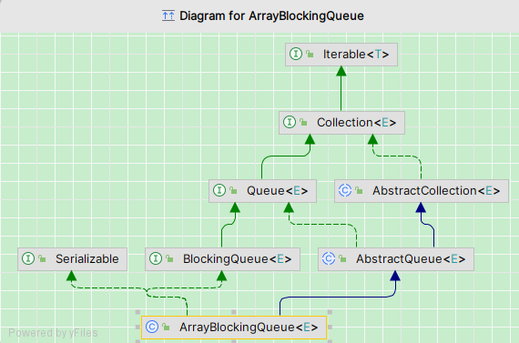

# ArrayBlockingQueue源码分析

&nbsp;&nbsp;本文将从`ArrayBlockingQueue`的类继承结构、构造方法以及关键源码三个方面进行深入解析，帮助大家全面理解其底层实现原理,本文基于JDK21。

## 目录
- [一、类继承结构](#一类继承结构)
- [二、构造方法](#二构造方法)
- [三、源码分析](#三源码分析)
    - [3.1 成员变量](#31-成员变量)
    - [3.2 入队操作 add/offer](#32-入队操作-addoffer)
    - [3.3 入队操作 put](#33-入队操作put)
    - [3.4 出队操作poll](#34-出队操作poll)
    - [3.5 出队操作take](#35-出队操作take)
    - [3.6 锁机制](#36-锁机制)
    - [3.7 其他操作](#37-其他操作)
- [四、总结](#四总结)

## 一、类继承结构
```java
public class ArrayBlockingQueue<E> extends AbstractQueue<E>
        implements BlockingQueue<E>, java.io.Serializable
```
类的继承结构图如下所示:



## 二、构造方法
```java
public ArrayBlockingQueue(int capacity)
public ArrayBlockingQueue(int capacity, boolean fair)
public ArrayBlockingQueue(int capacity, boolean fair, Collection<? extends E> c)
```
- capacity：必须指定容量，不能为负。
- fair：是否使用公平锁，默认不公平（false）。
- 第三个构造器允许初始化时传入集合并填充队列。

## 三、源码分析
### 3.1 成员变量
```java
  final Object[] items;
  final ReentrantLock lock;
  private final Condition notEmpty;
  private final Condition notFull;
  int count;
  int takeIndex;
  int putIndex;
```
- items：实际存储元素的数组。
- lock：可重入锁，控制并发访问。
- notEmpty/notFull：对应两个条件队列，用于线程等待和唤醒。
- count：当前元素数量。
- putIndex/takeIndex：数组中的入队和出队索引。

### 3.2 入队操作 add/offer
&nbsp;&nbsp;add方法的签名：
```java
public boolean add(E e) {
    if (offer(e))
        return true;
    else
        throw new IllegalStateException("Queue full");
}
```
从该方法可以看出，如果调用offer返回false会抛出错误异常，这种通常是队列已满才会出现这种情况，offer方法的签名如下：
```java
public boolean offer(E e) {
    Objects.requireNonNull(e);
    final ReentrantLock lock = this.lock;
    lock.lock();
    try {
        if (count == items.length)
            return false;
        else {
            enqueue(e);
            return true;
        }
    } finally {
        lock.unlock();
    }
}
```
添加的元素不能是null,如果是null会抛出空指针异常,用ReentrantLock进行加锁操作，判断元素的数量是否等于数组的长度,如果等于返回false,否则就调用enqueue方法，该方法签名如下:
```java
private void enqueue(E e) {
    final Object[] items = this.items;
    items[putIndex] = e;
    if (++putIndex == items.length) putIndex = 0;
    count++;
    notEmpty.signal();
}
```
将元素e放入putIndex位置,默认是0,putIndex自增以后判断是否等于数组长度，如果是把putIndex重置为0，这样就形成了一个环状数组，如果有0的位置元素被取走了，新的元素
被重新添加到0的位置，这样避免元素来回移动提高性能，count自增1,notEmpty.signal() 是为了唤醒正在等待队列有元素的线程，通常用于通知poll() 操作可以继续了。

### 3.3 入队操作put
&nbsp;&nbsp;put方法也是入队操作，那它和add方法有啥区别那，我们先分析完源码以后我会做一个对比，该方法的源码如下：
```java
public void put(E e) throws InterruptedException {
      Objects.requireNonNull(e);
      final ReentrantLock lock = this.lock;
      lock.lockInterruptibly();
      try {
          while (count == items.length)
              notFull.await();
          enqueue(e);
      } finally {
          lock.unlock();
      }
}
```
同样要求添加的元素不能为null,获取到ReentrantLock锁，可以响应中断操作，判断当前元素数量是否等于数组长度，如果等于则调用notFull.await阻塞当前添加线程。

可以看出这块和add方法不同的是put方法如果数组已满会阻塞添加线程，而add方法会直接抛出错误异常,下面画一个表格具体比对一下它们的区别:

| 方法	    |     队列满时行为     |  是否阻塞线程	   | 抛异常？ | 用途场景 |
|:-------|:-------------:|:-----------:|:--------:|:--------:
| add(E e) | 立即失败，抛出异常 |  	❌ 否	  | ✅ 抛 IllegalStateException| 想要立即知道队列是否满 |
| put(E e)	  |等待空间释放，直到成功	|    ✅ 是	    |❌ 不抛异常|	适用于生产者-消费者模型等场景 |

### 3.4 出队操作poll
&nbsp;&nbsp;poll方法的签名如下：
```java
public E poll() {
final ReentrantLock lock = this.lock;
    lock.lock();
    try {
      return (count == 0) ? null : dequeue();
    } finally {
      lock.unlock();
    }
}
```
还是获取到ReentrantLock锁，进行加锁操作，判断count是否等于0，如果等于0返回null,否则调用dequeue方法,该方法签名如下:
```java
private E dequeue() {
      
    final Object[] items = this.items;
    E e = (E) items[takeIndex];
    items[takeIndex] = null;
    if (++takeIndex == items.length) takeIndex = 0;
    count--;
    if (itrs != null)
        itrs.elementDequeued();
    notFull.signal();
    return e;
}
```
takeIndex默认值是0，从0开始获取元素，这就解释为了ArrayBlockingQueue是先进先出的了，把takeIndex位置处元素设置为null,takeIndex自增加1判断和元素
数组长度是否相等，如果相等同样把takeIndex赋值为0形成环向数组，把count值减少1，判断当前是否有迭代，如果有迭代需要通知迭代器当前已经删除了该元素，避免遍历出错，
notFull.signal()是为了唤醒正在等待队列没有元素的线程，通常用于通知add() 操作可以继续了。

### 3.5 出队操作take
&nbsp;&nbsp;take方法的签名如下：
```java
public E take() throws InterruptedException {
    final ReentrantLock lock = this.lock;
    lock.lockInterruptibly();
    try {
        while (count == 0)
            notEmpty.await();
        return dequeue();
    } finally {
        lock.unlock();
    }
}
```
获取到ReentrantLock锁，可以响应中断操作，判断当前元素数量是否等于0，如果等于则调用notEmpty.await阻塞当前取出线程，然后调用dequeue方法，这个方法在poll中已经分析过了。

### 3.6 锁机制

- ReentrantLock 控制并发，保证线程安全。
- 支持公平/非公平模式。
- 利用 Condition 分别管理 notEmpty 和 notFull 等待队列，防止唤醒冲突。

### 3.7 其他操作
- size()、remainingCapacity()：通过加锁读取共享变量。
- iterator()：提供弱一致性的迭代器。
- clear()：清空所有元素。

## 四、总结

- ArrayBlockingQueue 是一个基于数组的有界阻塞队列。
- 使用了显式锁机制 ReentrantLock 和条件变量 Condition 实现线程安全与阻塞功能。
- 更适用于任务队列、生产者-消费者模型等并发场景。